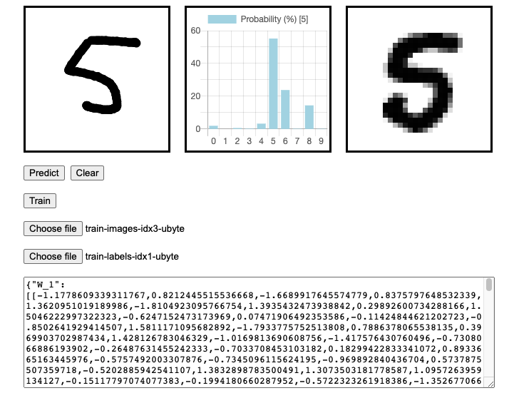

# NET-digit



```
# only if you wana do training
gunzip train-images-idx3-ubyte.gz
gunzip train-labels-idx1-ubyte.gz

# run the program and start predicting digit
yarn install && yarn start
```
[http://localhost:9090](http://localhost:9090)

## Training
* F12 to see the accuracy logging
* your browser will "hang" until the training is done
* training is supposed to be performed by Backend Server anyway...

## Steps to start training
* training data is standard data set from [http://yann.lecun.com/exdb/mnist/](http://yann.lecun.com/exdb/mnist/)
* unzip both gz files
* load `train-images-idx3-ubyte` as first file
* load `train-labels-idx1-ubyte` as second file
* hit the `Train` button
* the number of `epoch` will determine how fast the training ends
